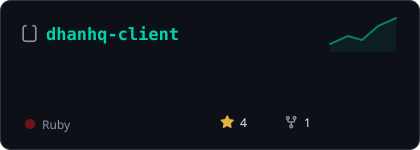
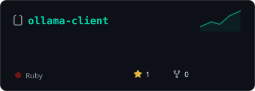

# shubhamtaywade82

*I build trading infrastructure, developer tooling, AI agents, and production SDKs — primarily in Ruby, TypeScript, and Python.*

---

## 📈 shipping

*Cards regenerate weekly with live star counts via GitHub Actions — no third-party stat services to break.*

---

## 🧰 stack

---

## 🏗️ featured projects

### DhanHQ Ecosystem

| Project | Description |
|---------|-------------|
| [**dhanhq-ts**](https://github.com/shubhamtaywade82/dhanhq-ts) | TypeScript SDK for DhanHQ v2 API — WebSocket market feed, order management, option Greeks, technical analysis, risk pipeline, MCP server, and agent toolkit. |
| [**dhanhq-client**](https://github.com/shubhamtaywade82/dhanhq-client) | Ruby SDK for the Dhan API — ActiveModel-style models, WebSocket streaming with auto-reconnect, order management, token lifecycle, pre-trade risk checks, and Rails integration. |
| [**dhanhq-charts**](https://github.com/shubhamtaywade82/dhanhq-charts) | Real-time charting for DhanHQ market data feeds. |
| [**dhanhq-mcp**](https://github.com/shubhamtaywade82/dhanhq-mcp) | MCP server integrating Dhan trade execution with AI agent runtimes. |
| [**algo_trading_api**](https://github.com/shubhamtaywade82/algo_trading_api) | Integrated trading API built on DhanHQ. |

### Trading Infrastructure

| Project | Description |
|---------|-------------|
| [**trading-agent-ts**](https://github.com/shubhamtaywade82/trading-agent-ts) | TypeScript trading agent with signal processing and execution. |
| [**trading-concepts-ts**](https://github.com/shubhamtaywade82/trading-concepts-ts) | Core trading concepts and primitives in TypeScript. |
| [**delta_exchange_bot**](https://github.com/shubhamtaywade82/delta_exchange_bot) | Automated trading bot for Delta Exchange. |
| [**paper_exchange**](https://github.com/shubhamtaywade82/paper_exchange) | Paper trading exchange simulator in Ruby. |
| [**alpha_research**](https://github.com/shubhamtaywade82/alpha_research) | Trading signal research and alpha generation. |
| [**crypto-trader**](https://github.com/shubhamtaywade82/crypto-trader) | Python-based cryptocurrency trading system. |
| [**nemesis-crypto-trading**](https://github.com/shubhamtaywade82/nemesis-crypto-trading) | High-performance crypto trading engine in Rust. |
| [**algo_scalper_api**](https://github.com/shubhamtaywade82/algo_scalper_api) | Algorithmic scalping API for live markets. |
| [**algo_scalper_python**](https://github.com/shubhamtaywade82/algo_scalper_python) | Python-based algorithmic scalping strategies. |
| [**pineforge-platform**](https://github.com/shubhamtaywade82/pineforge-platform) | Platform for PineScript strategy development and backtesting. |
| [**pinescript-skills**](https://github.com/shubhamtaywade82/pinescript-skills) | PineScript skill collection for TradingView indicators and strategies. |
| [**binance-client-js**](https://github.com/shubhamtaywade82/binance-client-js) | JavaScript client for the Binance API. |

### AI & Agent Runtimes

| Project | Description |
|---------|-------------|
| [**devagent-ts**](https://github.com/shubhamtaywade82/devagent-ts) | TypeScript developer automation framework. |
| [**devagent-py**](https://github.com/shubhamtaywade82/devagent-py) | Python developer agent runtime. |
| [**nemesis-ai**](https://github.com/shubhamtaywade82/nemesis-ai) | AI agent platform and orchestration. |
| [**neeti**](https://github.com/shubhamtaywade82/neeti) | AI decision engine and policy framework. |
| [**ollama-client**](https://github.com/shubhamtaywade82/ollama-client) | Ruby client for the Ollama API — local LLM inference. |
| [**ollama-client-js**](https://github.com/shubhamtaywade82/ollama-client-js) | TypeScript client for the Ollama API. |
| [**ollama_agent**](https://github.com/shubhamtaywade82/ollama_agent) | Ruby agent framework backed by Ollama models. |
| [**ollama-server**](https://github.com/shubhamtaywade82/ollama-server) | Python server infrastructure for Ollama deployments. |
| [**ollama-ecosystem**](https://github.com/shubhamtaywade82/ollama-ecosystem) | Tools, patterns, and integrations for the Ollama ecosystem. |

### Other Projects

| Project | Description |
|---------|-------------|
| [**expense_pro**](https://github.com/shubhamtaywade82/expense_pro) | Rails 8 expense tracking application with PostgreSQL. |
| [**janus**](https://github.com/shubhamtaywade82/janus) | Multi-protocol gateway service. |
| [**aegis**](https://github.com/shubhamtaywade82/aegis) | Authentication and authorization framework in Ruby. |
| [**chatbot**](https://github.com/shubhamtaywade82/chatbot) | Ruby conversational AI chatbot. |

---

## 📊 the tape

---

**Open to collaborations** — trading systems, agent infrastructure, SDK design, and developer tooling.