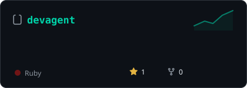
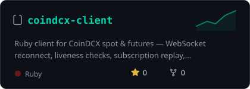
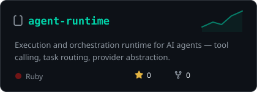
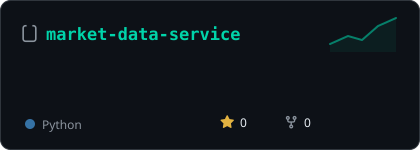
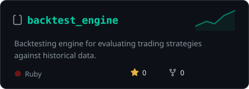

 

**Software engineer building production-oriented infrastructure for trading systems, AI agents, and developer tooling.**

*If a strategy can be automated, a broker API can be wrapped, or a workflow can be agentified, I'm probably shipping it — in Ruby, TypeScript, and Python.*

## 🎯 focus

<table>
<tr>
<td valign="top" width="33%">

**Trading Infrastructure**
- Market data & broker APIs
- WebSocket streaming
- Order execution & risk controls
- Backtesting & strategy research

</td>
<td valign="top" width="33%">

**AI & Agent Infrastructure**
- Agent runtimes & orchestration
- Tool calling / MCP servers
- Local LLMs (Ollama)
- Coding agents

</td>
<td valign="top" width="33%">

**Engineering**
- Ruby / Rails, TypeScript, Python
- PostgreSQL, Redis, SQLite
- Docker, GitHub Actions
- SDK & API design

</td>
</tr>
</table>

## 🏗️ featured engineering

cards regenerate weekly with live star counts — no third-party stat services to break

01. **[dhanhq-client](https://github.com/shubhamtaywade82/dhanhq-client)** — Production-oriented Ruby SDK for the Dhan API v2: typed domain models, resilient WebSocket infrastructure, token lifecycle management, validation contracts, dry-run guardrails, and order audit logging.
02. **[devagent](https://github.com/shubhamtaywade82/devagent)** — Local-first, controller-driven coding agent: bounded execution loops, Planner → Developer → Tester → Reviewer, repo-aware retrieval, sandboxed tool execution, session memory.
03. **[coindcx-client](https://github.com/shubhamtaywade82/coindcx-client)** — Ruby client for CoinDCX spot & futures trading infrastructure, with reconnecting WebSockets, liveness checks, and explicit at-least-once delivery semantics.
04. **[agent-runtime](https://github.com/shubhamtaywade82/agent-runtime)** — Execution and orchestration infrastructure for AI agents.
05. **[market-data-service](https://github.com/shubhamtaywade82/market-data-service)** — Market-data infrastructure for algorithmic trading systems.
06. **[backtest_engine](https://github.com/shubhamtaywade82/backtest_engine)** — Backtesting engine for quantitative strategy research.

## 🧰 stack

## 📚 project map

### DhanHQ ecosystem

End-to-end programmatic trading on Indian exchanges (NSE/BSE/MCX) — from low-level API clients to live trading bots and agent frameworks.

| Project | Description |
|---------|-------------|
| [**dhanhq-ts**](https://github.com/shubhamtaywade82/dhanhq-ts) | TypeScript SDK for DhanHQ v2 API — WebSocket market feed, order management, option Greeks, technical analysis, risk pipeline, MCP server, and agent toolkit. |
| [**dhanhq-client**](https://github.com/shubhamtaywade82/dhanhq-client) | Ruby SDK for the Dhan API — ActiveModel-style models, WebSocket streaming with auto-reconnect, order management, token lifecycle, pre-trade risk checks, and Rails integration. |
| [**dhanhq-charts**](https://github.com/shubhamtaywade82/dhanhq-charts) | Real-time charting for DhanHQ market data feeds. |
| [**dhanhq-mcp**](https://github.com/shubhamtaywade82/dhanhq-mcp) | MCP server integrating Dhan trade execution with AI agent runtimes. |
| [**algo_trading_api**](https://github.com/shubhamtaywade82/algo_trading_api) | Integrated trading API built on DhanHQ. |

### Trading infrastructure

| Project | Description |
|---------|-------------|
| [**trading-agent-ts**](https://github.com/shubhamtaywade82/trading-agent-ts) | TypeScript trading agent with signal processing and execution. |
| [**trading-concepts-ts**](https://github.com/shubhamtaywade82/trading-concepts-ts) | Core trading concepts and primitives in TypeScript. |
| [**delta_exchange_bot**](https://github.com/shubhamtaywade82/delta_exchange_bot) | Automated trading bot for Delta Exchange. |
| [**paper_exchange**](https://github.com/shubhamtaywade82/paper_exchange) | Paper trading exchange simulator in Ruby. |
| [**alpha_research**](https://github.com/shubhamtaywade82/alpha_research) | Trading signal research and alpha generation. |
| [**crypto-trader**](https://github.com/shubhamtaywade82/crypto-trader) | Python-based cryptocurrency trading system. |
| [**nemesis-crypto-trading**](https://github.com/shubhamtaywade82/nemesis-crypto-trading) | High-performance crypto trading engine in Rust. |
| [**algo_scalper_api**](https://github.com/shubhamtaywade82/algo_scalper_api) | Algorithmic scalping API for live markets. |
| [**algo_scalper_python**](https://github.com/shubhamtaywade82/algo_scalper_python) | Python-based algorithmic scalping strategies. |
| [**pineforge-platform**](https://github.com/shubhamtaywade82/pineforge-platform) | Platform for PineScript strategy development and backtesting. |
| [**pinescript-skills**](https://github.com/shubhamtaywade82/pinescript-skills) | PineScript skill collection for TradingView indicators and strategies. |
| [**binance-client-js**](https://github.com/shubhamtaywade82/binance-client-js) | JavaScript client for the Binance API. |

### AI & agent runtimes

| Project | Description |
|---------|-------------|
| [**devagent-ts**](https://github.com/shubhamtaywade82/devagent-ts) | TypeScript developer automation framework. |
| [**devagent-py**](https://github.com/shubhamtaywade82/devagent-py) | Python developer agent runtime. |
| [**nemesis-ai**](https://github.com/shubhamtaywade82/nemesis-ai) | AI agent platform and orchestration. |
| [**neeti**](https://github.com/shubhamtaywade82/neeti) | AI decision engine and policy framework. |
| [**ollama-client**](https://github.com/shubhamtaywade82/ollama-client) | Ruby client for the Ollama API — local LLM inference. |
| [**ollama-client-js**](https://github.com/shubhamtaywade82/ollama-client-js) | TypeScript client for the Ollama API. |
| [**ollama_agent**](https://github.com/shubhamtaywade82/ollama_agent) | Ruby agent framework backed by Ollama models. |
| [**ollama-server**](https://github.com/shubhamtaywade82/ollama-server) | Python server infrastructure for Ollama deployments. |
| [**ollama-ecosystem**](https://github.com/shubhamtaywade82/ollama-ecosystem) | Tools, patterns, and integrations for the Ollama ecosystem. |

### Other projects

| Project | Description |
|---------|-------------|
| [**expense_pro**](https://github.com/shubhamtaywade82/expense_pro) | Full-stack expense tracking application. |
| [**janus**](https://github.com/shubhamtaywade82/janus) | Multi-protocol gateway service. |
| [**aegis**](https://github.com/shubhamtaywade82/aegis) | Authentication and authorization framework in Ruby. |
| [**chatbot**](https://github.com/shubhamtaywade82/chatbot) | Ruby conversational AI chatbot. |

## 📊 the tape

  

  

---

`the market doesn't care about your feelings. neither does the compiler.`

**Open to collaborations** — trading systems, agent infrastructure, SDK design, and developer tooling.

---
