# tradesdontlie

*I build the tools that sit between AI and the markets — MCP servers, Pine Script tooling, trading automation, and developer infrastructure. If a chart can be analyzed, a strategy can be coded, or a workflow can be automated, I'm probably shipping it.*

---

## 📈 shipping

[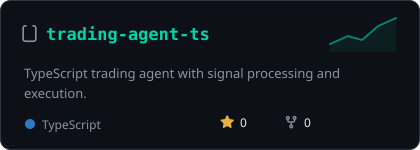](https://github.com/tradesdontlie/trading-agent-ts)
[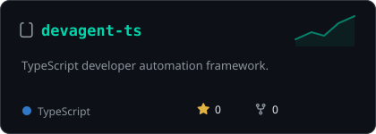](https://github.com/tradesdontlie/devagent-ts)
[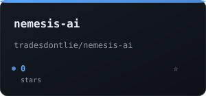](https://github.com/tradesdontlie/nemesis-ai)
[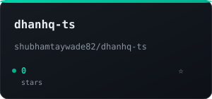](https://github.com/tradesdontlie/dhanhq-ts)
[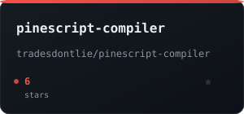](https://github.com/tradesdontlie/pinescript-compiler)
[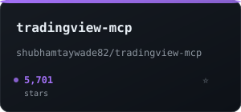](https://github.com/tradesdontlie/tradingview-mcp)
[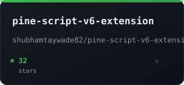](https://github.com/tradesdontlie/pine-script-v6-extension)
[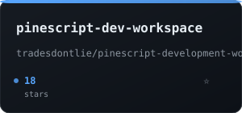](https://github.com/tradesdontlie/pinescript-development-workspace)
[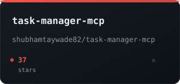](https://github.com/tradesdontlie/task-manager-mcp)
[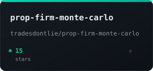](https://github.com/tradesdontlie/prop-firm-monte-carlo)
[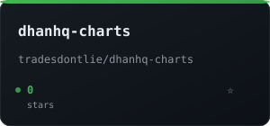](https://github.com/tradesdontlie/dhanhq-charts)
[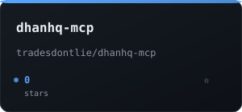](https://github.com/tradesdontlie/dhanhq-mcp)

*Cards regenerate weekly with live star counts via GitHub Actions — no third-party stat services to break.*

---

## 🧰 stack

---

## 🏗️ featured projects

### AI Agent Runtimes & Infrastructure

| Project | Description | Stack |
|---------|-------------|-------|
| [**nemesis-ai**](https://github.com/tradesdontlie/nemesis-ai) | Shared AI runtime for Nemesis agents — provider-agnostic LLM router with health-based routing, retry/timeout policies, and capability-based model selection. Powers `trading-agent-ts`, `devagent-ts`, and custom agents. | TypeScript, Node.js |
| [**devagent-ts**](https://github.com/tradesdontlie/devagent-ts) | Local-first, controller-driven coding agent for TypeScript/JS projects. Planner → Developer → Tester → Reviewer loop with JSON tool call validation, sandboxed file access, and multi-provider LLM adapters (Ollama + OpenAI). | TypeScript, Node.js, SQLite |
| [**ollama-server**](https://github.com/tradesdontlie/ollama-server) | GPU-tuned Ollama in Docker with optional model router (OpenAI-compatible `/v1` API), dev-agent loop runner, benchmark suite, and strict trading schemas for token-only options decisions. | Python, Docker, CUDA |
| [**ai-trading-agent**](https://github.com/tradesdontlie/ai-trading-agent) | Production-ready Ruby trading agent combining LLM reasoning (Ollama) with real-time DhanHQ market data. Strict planner-based architecture with tool calling for deterministic step-by-step execution. | Ruby, Ollama, DhanHQ |

### DhanHQ Ecosystem (Indian Markets: NSE/BSE/MCX)

| Project | Description | Stack |
|---------|-------------|-------|
| [**dhanhq-ts**](https://github.com/tradesdontlie/dhanhq-ts) | TypeScript SDK for DhanHQ v2 API — WebSocket market feed, order management, option Greeks, technical analysis, risk pipeline, MCP server, and agent toolkit. | TypeScript, WebSocket, MCP |
| [**dhanhq-charts**](https://github.com/tradesdontlie/dhanhq-charts) | Real-time charting for DhanHQ market data feeds with technical indicators, multi-timeframe support, and Pine Script strategy visualization. | TypeScript, Canvas/WebGL |
| [**dhanhq-mcp**](https://github.com/tradesdontlie/dhanhq-mcp) | MCP server integrating Dhan trade execution with AI agent runtimes. Exposes order placement, position management, and market data as MCP tools. | TypeScript, MCP |
| [**dhan-scalper**](https://github.com/tradesdontlie/dhan-scalper) | Automated options scalping toolkit — Thor CLI, paper/live modes, Redis-backed state, instrument master CSV, pre-trade risk checks. | Ruby, Redis, Thor |

### Pine Script & TradingView Tooling

| Project | Description | Stack |
|---------|-------------|-------|
| [**pine-script-v6-extension**](https://github.com/tradesdontlie/pine-script-v6-extension) | VS Code extension for Pine Script v6 — LSP integration, syntax highlighting, diagnostics, hover docs, go-to-definition, and Pine Compiler backend. | TypeScript, VS Code API, LSP |
| [**pinescript-compiler**](https://github.com/tradesdontlie/pinescript-compiler) | Standalone Pine Script compiler — parses, validates, and transpiles Pine Script to JavaScript/WASM for browser-based backtesting. | Rust, WASM |
| [**pinescript-development-workspace**](https://github.com/tradesdontlie/pinescript-development-workspace) | Complete Pine Script dev environment — monorepo with compiler, LSP server, test runner, CI templates, and example strategies. | TypeScript, Rust, GitHub Actions |
| [**tradingview-mcp**](https://github.com/tradesdontlie/tradingview-mcp) | MCP server for TradingView — chart data extraction, Pine Script execution, alert webhook handling, and strategy backtesting via MCP tools. | TypeScript, MCP, Puppeteer |

### Trading Infrastructure & Research

| Project | Description | Stack |
|---------|-------------|-------|
| [**trading-agent-ts**](https://github.com/tradesdontlie/trading-agent-ts) | TypeScript trading agent with signal processing, position management, risk controls, and multi-venue execution (DhanHQ, Binance, Delta). | TypeScript, nemesis-ai |
| [**trading-concepts-ts**](https://github.com/tradesdontlie/trading-concepts-ts) | Core trading primitives — orders, positions, portfolio, risk metrics, Greeks, option chains, market data structures. Zero dependencies. | TypeScript |
| [**alpha-research**](https://github.com/tradesdontlie/alpha-research) | Signal research framework — factor modeling, backtesting engine, walk-forward optimization, and regime detection. | Python, Polars, NumPy |
| [**prop-firm-monte-carlo**](https://github.com/tradesdontlie/prop-firm-monte-carlo) | Monte Carlo simulator for prop firm challenges — models drawdown paths, profit targets, consistency rules, and optimal sizing. | Python, NumPy, SciPy |
| [**paper-exchange**](https://github.com/tradesdontlie/paper-exchange) | Paper trading exchange simulator — order matching engine, WebSocket feed, REST API, and portfolio analytics. | Ruby, WebSocket |
| [**crypto-trader**](https://github.com/tradesdontlie/crypto-trader) | Python-based cryptocurrency trading system — exchange connectors, strategy framework, risk management, and portfolio tracking. | Python, ccxt |

### MCP Servers & Developer Tooling

| Project | Description | Stack |
|---------|-------------|-------|
| [**task-manager-mcp**](https://github.com/tradesdontlie/task-manager-mcp) | MCP server for task management — create, update, query tasks with dependencies, priorities, and project hierarchy. SQLite backend. | TypeScript, SQLite, MCP |
| [**binance-client-js**](https://github.com/tradesdontlie/binance-client-js) | JavaScript client for Binance Spot/Futures — typed REST/WebSocket, order management, WebSocket streams, and convert API. | TypeScript, WebSocket |

---

## 📊 the tape

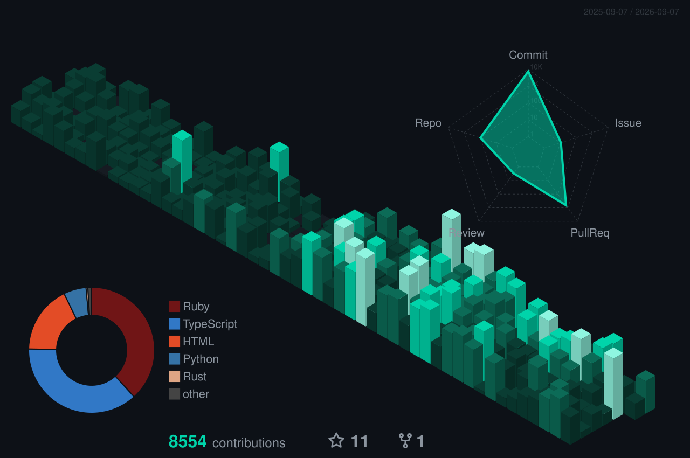

---

## 🔍 currently exploring

- **Agent-to-agent protocols** — A2A communication for multi-agent trading systems
- **WebGPU compute shaders** — Browser-based options pricing Greeks at scale
- **Rust + WASM for Pine Script** — Near-native speed Pine Script execution in browser
- **Local LLM fine-tuning** — Domain adaptation for trading reasoning on consumer GPUs
- **Zero-copy market data** — Shared memory market feeds for ultra-low latency

---

## 🤝 open to collaborations

Trading systems · Agent infrastructure · SDK design · Developer tooling · Pine Script ecosystem · MCP servers

---

`opinions are noise. price is data. trades don't lie.`