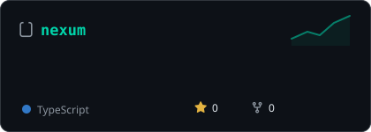
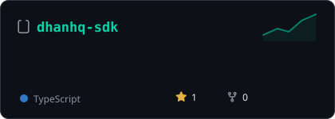
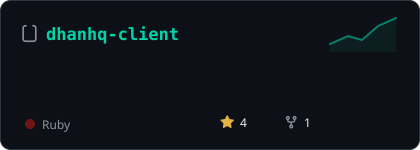
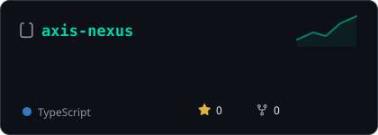
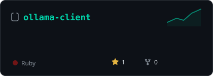
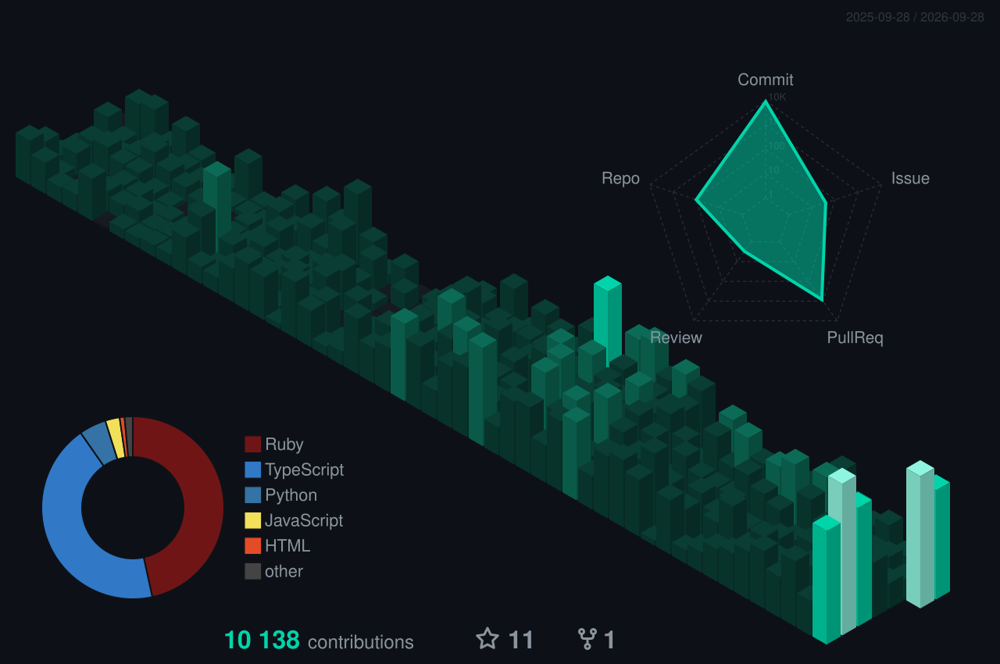

 

**Software engineer building production-oriented infrastructure for trading systems, AI agents, and developer tooling.**

*If a strategy can be automated, a broker API can be wrapped, or a workflow can be agentified, I'm probably shipping it — in TypeScript, Ruby, and Python.*

## 🤖 flagship

**[nexum](https://github.com/shubhamtaywade82/nexum)** — autonomous software engineering, from task to pull request.
Agent runtime, tool gateway, semantic memory, hybrid RAG, multi-agent coordination, and a CLI. *(Developer Preview 2.0.0-alpha, successor to devagent-ts)*

## 📦 published packages

**npm** — [`@nemesis-oss`](https://www.npmjs.com/org/nemesis-oss) scope

| Package | Version | What it does |
|---------|---------|---------------|
| [`@nemesis-oss/dhanhq-sdk`](https://www.npmjs.com/package/@nemesis-oss/dhanhq-sdk) | 1.1.0 | TypeScript SDK for DhanHQ v2 — REST, WebSocket feed, option analytics, risk pipeline, MCP server |
| [`@nemesis-oss/ollama-sdk`](https://www.npmjs.com/package/@nemesis-oss/ollama-sdk) | 1.3.0 | TypeScript SDK for Ollama — native fetch, HA failover, tool calling, OpenAI/Anthropic bridges, MCP |
| [`@nemesis-oss/binance-sdk`](https://www.npmjs.com/package/@nemesis-oss/binance-sdk) | 3.0.0 | Spot/USD-M/COIN-M Futures/Margin/Wallet, HMAC/Ed25519/RSA signing, MCP server |
| [`@nemesis-oss/coindcx-sdk`](https://www.npmjs.com/package/@nemesis-oss/coindcx-sdk) | 1.2.0 | Spot/Margin/Futures for CoinDCX, local paper engine, MCP toolkits |
| [`@nemesis-oss/agentic-runtime`](https://www.npmjs.com/package/@nemesis-oss/agentic-runtime) | 0.2.1 | Model-agnostic autonomous agent runtime — Brain/Hands/Memory/Loop |
| [`@nemesis-oss/devagent-ts`](https://www.npmjs.com/package/@nemesis-oss/devagent-ts) | 1.0.0 | Terminal coding-agent runtime, Docker sandbox, LSP intelligence |

**RubyGems**

| Gem | Version | Downloads |
|-----|---------|-----------|
| [`DhanHQ`](https://rubygems.org/gems/DhanHQ) | 3.4.0 | 12.5k+ |
| [`ollama-client`](https://rubygems.org/gems/ollama-client) | 1.4.0 | production-safe Ruby AI SDK for Ollama |

## 📈 shipping

cards regenerate weekly with live star counts — no third-party stat services to break

## 🧰 stack

## 📚 project map

### DhanHQ ecosystem

End-to-end programmatic trading on Indian exchanges (NSE/BSE/MCX) — from low-level API clients to live trading bots.

| Project | Description |
|---------|-------------|
| [**dhanhq-sdk**](https://github.com/shubhamtaywade82/dhanhq-sdk) | TypeScript/Node.js SDK for DhanHQ v2 — WebSocket feed, option Greeks, risk pipeline, MCP server. Published as `@nemesis-oss/dhanhq-sdk`. |
| [**dhanhq-client**](https://github.com/shubhamtaywade82/dhanhq-client) | Ruby SDK for the Dhan API v2 — ActiveModel-style models, auto-reconnecting WebSocket, order lifecycle, Rails integration. Published as gem `DhanHQ` (12.5k+ downloads). |
| [**dhanhq-mcp**](https://github.com/shubhamtaywade82/dhanhq-mcp) | Model Context Protocol adapter exposing DhanHQ trading services to AI agents. |
| [**dhanhq-charts**](https://github.com/shubhamtaywade82/dhanhq-charts) | React/TypeScript trading dashboard — NIFTY/SENSEX views, SMC swing highs/lows, TradingView-style charts. |
| [**algo_trading_api**](https://github.com/shubhamtaywade82/algo_trading_api) | DhanHQ-integrated trading API. |
| [**axis-nexus**](https://github.com/shubhamtaywade82/axis-nexus) | Autonomous options trading system on DhanHQ v2 — backend + control-plane frontend, built on `dhanhq-sdk`. |

### Trading agents & systems

| Project | Description |
|---------|-------------|
| [**vyuha-options-agent**](https://github.com/shubhamtaywade82/vyuha-options-agent) | Autonomous options execution agent for NIFTY/SENSEX using DhanHQ v2 + local SLMs via Ollama. |
| [**trading-agent-ts**](https://github.com/shubhamtaywade82/trading-agent-ts) | Agentic AI trading bot built on `binance-sdk`, `ollama-sdk`, and `agentic-runtime`. |
| [**crypto-trading-agent**](https://github.com/shubhamtaywade82/crypto-trading-agent) | Binance USD-M perpetuals agent — multi-strategy signals, Ollama LLM veto layer, TUI cockpit. |
| [**crypto-agent**](https://github.com/shubhamtaywade82/crypto-agent) | Agentic crypto futures system with a deterministic trading kernel and Gemma-4 (via `ollama-sdk`) as the intelligence layer. |
| [**paper-broker**](https://github.com/shubhamtaywade82/paper-broker) | Crypto futures paper-trading engine on live Binance data, with a real-time WS dashboard. |
| [**paper_exchange**](https://github.com/shubhamtaywade82/paper_exchange) | Rails exchange simulator — Indian equity/F&O (DhanHQ) and crypto futures (Binance/CoinDCX) behind one API. |
| [**algo_scalper_api**](https://github.com/shubhamtaywade82/algo_scalper_api) | Autonomous intraday options scalper for NIFTY/BANKNIFTY/SENSEX — Supertrend + ADX + SMC signals. |
| [**algo_scalper_python**](https://github.com/shubhamtaywade82/algo_scalper_python) | Unified DhanHQ algo-options monorepo, consolidated from 7 Python projects. |
| [**market-intelligence**](https://github.com/shubhamtaywade82/market-intelligence) | Deterministic market-event detection and counterfactual research engine for systematic trading. |
| [**alpha_research**](https://github.com/shubhamtaywade82/alpha_research) | Symbol-differentiated signal engine for USDS-M perpetuals (research stage). |
| [**nemesis-crypto-trading**](https://github.com/shubhamtaywade82/nemesis-crypto-trading) | Hybrid Rust/Python crypto trading engine — Binance Futures WS, deterministic bar building. |
| [**trading-concepts-ts**](https://github.com/shubhamtaywade82/trading-concepts-ts) | Framework-agnostic SMC + ICT + price-action analysis engine. |
| [**smc-backtester**](https://github.com/shubhamtaywade82/smc-backtester) | Pure-Ruby SMC/ICT rules engine and backtest simulator. |
| [**chart-sdk**](https://github.com/shubhamtaywade82/chart-sdk) | Broker-agnostic trading chart SDK on TradingView Lightweight Charts v5. |
| [**pine-ts**](https://github.com/shubhamtaywade82/pine-ts) | Pine Script v6-inspired trading runtime for TypeScript. |

### AI agent runtimes & dev tooling

| Project | Description |
|---------|-------------|
| [**nexum**](https://github.com/shubhamtaywade82/nexum) | Autonomous software-engineering agent — task to pull request. |
| [**devagent**](https://github.com/shubhamtaywade82/devagent) | Local-first, controller-driven coding agent for Ruby projects (Planner → Developer → Tester → Reviewer). |
| [**agentic-runtime**](https://github.com/shubhamtaywade82/agentic-runtime) | Model-agnostic autonomous agent runtime — Brain/Hands/Memory/Loop pillars, MCP-native. |
| [**agentic-query**](https://github.com/shubhamtaywade82/agentic-query) | ORM-native AI query runtime for Rails/Node — LLM-interpreted questions with schema-aware authorization. |
| [**agentic-chat**](https://github.com/shubhamtaywade82/agentic-chat) | Next.js playground visualizing a live ReAct (reason/act/observe) agent loop. |
| [**toolery-ts**](https://github.com/shubhamtaywade82/toolery-ts) | Deterministic tool-calling benchmark for LLM endpoints. |
| [**nodeforge**](https://github.com/shubhamtaywade82/nodeforge) | Orchestration control plane unifying TS/ESLint/Vitest/Docker/Git behind one model, for IDEs and AI agents. |
| [**nemesis-ai**](https://github.com/shubhamtaywade82/nemesis-ai) | Shared AI runtime backing the Nemesis agent projects. |
| [**ruby-agent-skills**](https://github.com/shubhamtaywade82/ruby-agent-skills) | Agent-executable Ruby/Rails engineering knowledge, packaged as installable skill packs. |

### Exchange SDKs & clients

| Project | Description |
|---------|-------------|
| [**ollama-client**](https://github.com/shubhamtaywade82/ollama-client) | Ruby AI SDK for Ollama — deterministic, contract-driven, zero magic. Gem `ollama-client`. |
| [**ollama-client-js**](https://github.com/shubhamtaywade82/ollama-client-js) | TypeScript SDK wrapping `ollama-js` with retries, failover, structured outputs, MCP adapter. |
| [**binance-sdk**](https://github.com/shubhamtaywade82/binance-sdk) | Full Spot/Futures/Margin coverage, zod-validated, MCP server. |
| [**coindcx-sdk**](https://github.com/shubhamtaywade82/coindcx-sdk) | CoinDCX Spot/Margin/Futures with a local paper-trading engine. |

### Other

| Project | Description |
|---------|-------------|
| [**neeti**](https://github.com/shubhamtaywade82/neeti) | Chanakya Niti–based AI advisor — structured RAG over 455 sutras, ReAct + reflection agent. |
| [**expense_pro**](https://github.com/shubhamtaywade82/expense_pro) | Full-stack expense tracking application. |

## 📊 the tape

  

  

---

`the market doesn't care about your feelings. neither does the compiler.`

**Open to collaborations** — trading systems, agent infrastructure, SDK design, and developer tooling.

---
